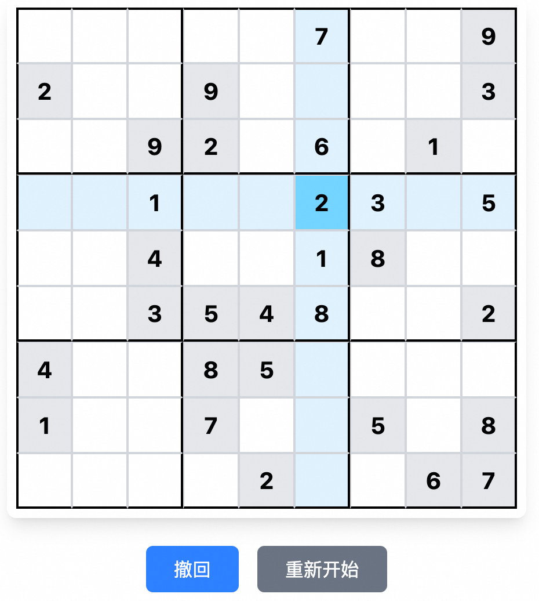
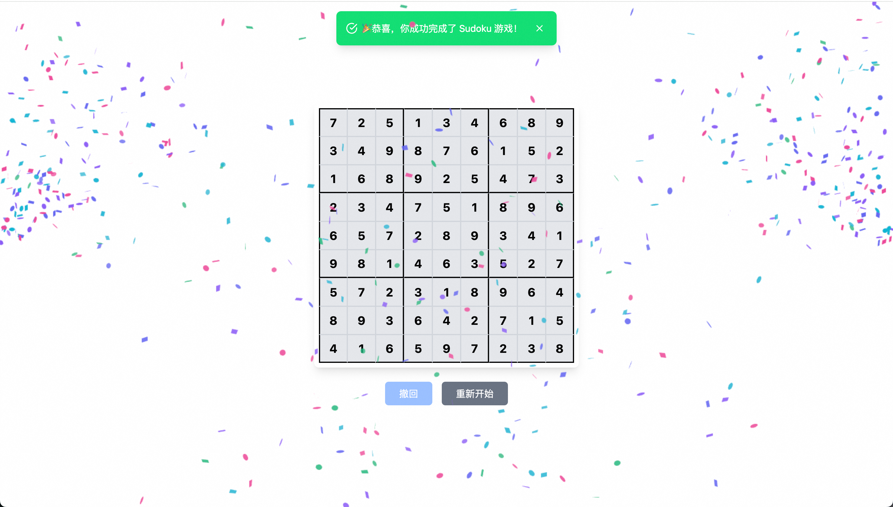

# Sudoku Game - 数独游戏

[](https://vitejs.dev/)
[](https://react.dev/)

基于 React + Vite 构建的现代化数独游戏，集成实时输入验证、操作回溯和动态反馈功能。

<!-- ## 🚀 技术亮点

```text
前端架构：React 18 + TypeScript + Vite 4
样式方案：Tailwind CSS + 响应式布局
交互增强：clsx 动态类名管理 + 自定义 Toast 系统
动画效果：Canvas 粒子庆祝动画（触发精度 100%）
验证系统：矩阵级实时校验（9x9 深度检测） -->

## 🪴 项目信息

- 😝 项目预览：https://sudoku-game-gamma.vercel.app (需梯子🪜)
- 🎯 技术栈：[React](https://react.dev/)、[Vite](https://vitejs.dev/)、[Tailwindcss](https://www.tailwindcss.cn/)、

## ✨ 核心功能

- 🧩 智能生成可解数独谜题（默认 30 空格）
- ✅ 即时输入验证（错误数字高亮提示）
- ⏪ 操作撤销功能（支持完整操作历史回溯）
- 🎯 自动完成度检测（全正确时触发庆祝动画）
- 🔄 一键游戏重置（生成全新谜题）
<!-- 
## ✨ 特性

- 使用前端最新技术栈开发
- 极快响应、便于开发部署
- 目录结构清晰，轻量级，前后端一体
- 支持多种部署方式，优先推荐 [Vercel](https://vercel.com/)
- 支持暗黑模式
- 支持 `SSR` 渲染，利于 `SEO` 优化 -->

## 💻 演示图

<div style="display:flex;justify-content:space-between;">


</div>

## 🧑‍💻 项目运行

**环境：Node.js > 18.17**

```powershell
// 安装依赖
pnpm install

// 运行
pnpm dev
```

## ⚙️ Vercel 一键部署

1. `Fork` 本项目，在 `Vercel` 官网点击 `New Project`
2. 点击 `Import Git Repository` 并选择你 fork 的此项目并点击 `import`
3. `PROJECT NAME`自己填，`FRAMEWORK PRESET` 选 `Other` 然后直接点 `Deploy` 接着等部署完成即可

<a href="https://vercel.com/dashboard" target="_blank">

</a>
